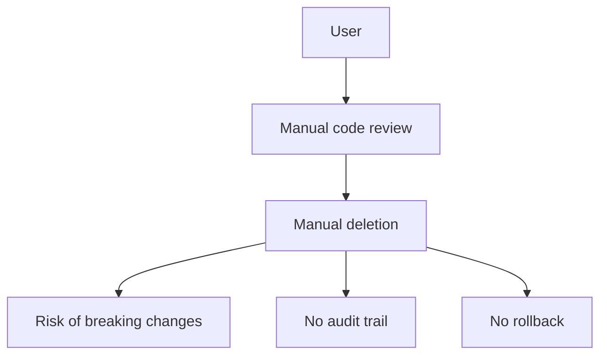
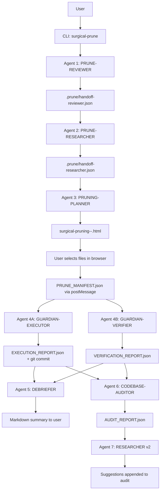

# Architecture Blueprint

## Scope

In scope: Complete implementation of 7-agent Surgical Pruning system per IMPLEMENTATION_PLAN.md and SurgicalpruningConcept.txt v2.0
Out of scope: Features not in spec (e.g., GUI beyond HTML planner, language support beyond TS/JS/Python/Rust/Go, cloud deployment)

## Current architecture

## Target architecture

## Areas being edited

| Area                   | Current location              | Planned change                                                                                                 | Reason                                           | Risk                                                |
| ---------------------- | ----------------------------- | -------------------------------------------------------------------------------------------------------------- | ------------------------------------------------ | --------------------------------------------------- |
| Monorepo scaffold      | / (root)                      | Add packages/reviewer, /researcher, /planner, /executor, /verifier, /debriefer, /auditor, /researcher-v2, /cli | Foundation for all agents                        | LOW - additive only                                 |
| Core schemas           | /packages/core/src/schemas.ts | Add Zod schemas for all 7 handoff artifacts + PRUNE_MANIFEST + reports                                         | Type-safe contracts between agents               | LOW - additive, validates at compile time           |
| Core utils             | /packages/core/src/utils.ts   | Add git ops, file scanning, confidence scoring, SHA256                                                         | Shared infrastructure                            | LOW - pure functions, testable                      |
| Agent 1: Reviewer      | N/A                           | New package @surgical-pruning/reviewer                                                                         | Implements static analysis + dead code detection | MEDIUM - external tool integration (knip, depcheck) |
| Agent 2: Researcher    | N/A                           | New package @surgical-pruning/researcher                                                                       | Web research + best practice synthesis           | MEDIUM - web API dependency                         |
| Agent 3: Planner       | N/A                           | New package @surgical-pruning/planner                                                                          | Generates self-contained HTML with D3/Mermaid    | HIGH - complex HTML generation, embedded assets     |
| Agent 4A: Executor     | N/A                           | New package @surgical-pruning/executor                                                                         | Safe file deletion with git checkpoint/rollback  | CRITICAL - destructive operations                   |
| Agent 4B: Verifier     | N/A                           | New package @surgical-pruning/verifier                                                                         | Concurrent validation + ABORT capability         | HIGH - concurrency, must not miss violations        |
| Agent 5: Debriefer     | N/A                           | New package @surgical-pruning/debriefer                                                                        | Markdown summary generation                      | LOW - template rendering                            |
| Agent 6: Auditor       | N/A                           | New package @surgical-pruning/auditor                                                                          | Post-prune codebase health analysis              | MEDIUM - multiple analysis tools                    |
| Agent 7: Researcher v2 | N/A                           | New package @surgical-pruning/researcher-v2                                                                    | Improvement suggestions from audit               | MEDIUM - web API dependency                         |
| CLI                    | N/A                           | New package @surgical-pruning/cli                                                                              | Unified entry point, orchestrates pipeline       | MEDIUM - process coordination                       |
| CI/CD                  | /.github/workflows/           | Add lint, typecheck, test, build, release workflows                                                            | Automated quality gates                          | LOW - standard GitHub Actions                       |
| Tests                  | /tests/                       | Add fixtures + integration tests                                                                               | Validation of full pipeline                      | MEDIUM - test maintenance                           |

## Interfaces / dependencies

- @surgical-pruning/core: Zod schemas (all handoff artifacts), utils (git, scan, confidence, crypto)
- @surgical-pruning/cli: Imports all agent packages, orchestrates sequential pipeline
- knip: Dead code detection (Agent 1) - devDependency of reviewer package
- depcheck@7.16.4: Unused dependency detection (Agent 1) - devDependency of reviewer package
- execa: Git/process execution (core, executor, verifier)
- fast-glob: File scanning (core, reviewer)
- vitest: Testing (all packages)
- D3.js v7 (minified): Embedded in HTML output (planner)
- Mermaid.js v11: CDN + localStorage cache (planner)

## Data / control flow

1. CLI receives target path + prompt → validates git repo → creates .prune dir
2. Agent 1 (Reviewer) scans target → produces handoff-reviewer.json
3. Agent 2 (Researcher) reads handoff-reviewer.json + prompt → produces handoff-researcher.json
4. Agent 3 (Planner) reads both handoffs → generates HTML → opens in browser
5. User interacts with HTML → selects files → clicks PRUNE → HTML posts PRUNE_MANIFEST.json to parent
6. CLI receives manifest → spawns Agent 4A (Executor) + Agent 4B (Verifier) in parallel
7. Executor: verifies manifest SHA256 + git commit → stash checkpoint → rollback script → dry-run → execute → build verify → commit → EXECUTION_REPORT.json
8. Verifier: tails execution.log → validates no protected files, git clean, build passes → writes ABORT on violation → VERIFICATION_REPORT.json
9. On success: CLI spawns Agent 5 (Debriefer) + Agent 6 (Auditor) in parallel
10. Debriefer: reads EXECUTION_REPORT + handoff-reviewer → markdown summary → outputs to user
11. Auditor: reads post-prune git state + handoff-reviewer → AUDIT_REPORT.json
12. Agent 7 (Researcher v2): reads AUDIT_REPORT + handoff-researcher → web research → appends 5+ suggestions to audit
13. CLI outputs final summary + rollback instructions to user

## Security boundaries

- Protected paths (spec-defined) are hardcoded in core utils - never configurable
- Confidence thresholds enforced in Agent 1 & 3 - cannot be lowered via CLI
- Git operations use execa with explicit args - no shell injection
- Web research (Agents 2, 7) uses Nous-provided web tools - no direct fetch
- Rollback script generated with set -euo pipefail - fails fast on error
- Manifest SHA256 verified before execution - tamper detection
- No secrets in any artifact - security scan in Auditor

## Assumptions

- Target is a git repository with clean working tree (or user accepts stash)
- Node.js >=20, pnpm available
- Web search API available for Agents 2 & 7
- User has browser to interact with HTML planner
- Build command detectable from package.json (pnpm build / npm run build / etc.)

## Acceptance criteria mapping

- [ ] AC-001 → Monorepo build (Turbo pipeline)
- [ ] AC-002 → Core schemas package exports all artifact types
- [ ] AC-003 → CLI package with surgical-prune command
- [ ] AC-004 → Reviewer package produces valid handoff-reviewer.json
- [ ] AC-005 → Researcher package produces valid handoff-researcher.json
- [ ] AC-006 → Planner package generates HTML with all 5 UI components
- [ ] AC-007 → Executor creates stash + rollback script before deletion
- [ ] AC-008 → Verifier runs concurrent + can create ABORT
- [ ] AC-009 → Debriefer produces markdown with all template sections
- [ ] AC-010 → Auditor produces report with all 5 scope areas
- [ ] AC-011 → Researcher v2 appends ≥5 suggestions to audit
- [ ] AC-012 → E2E test passes on fixture projects
- [ ] AC-013 → GitHub Actions workflow runs all gates
- [ ] AC-014 → npm publish succeeds
- [ ] AC-015 → Safety requirements enforced in code (not just docs)
